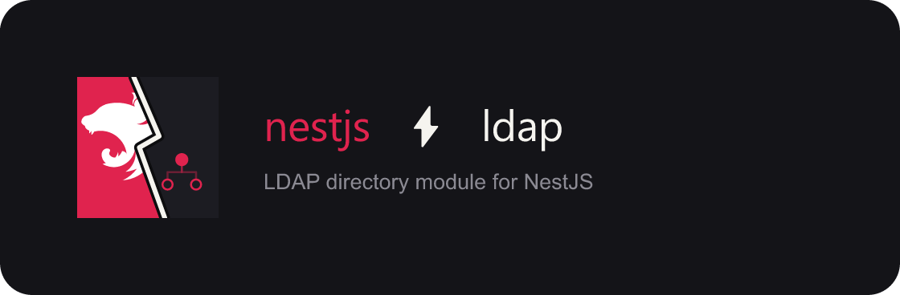

# Branding — `@tacxou/nestjs_module_ldap`

Visual identity for the package. **Canonical source:** the versioned assets in
[`docs/assets/`](assets/).

## Assets

| Asset | Format | Usage |
| --- | --- | --- |
| [`logo-lockup-2b.svg`](assets/logo-lockup-2b.svg) | SVG | Source lockup (horizontal) |
| [`logo-lockup-2b.png`](assets/logo-lockup-2b.png) | PNG | README header, npm package page, wide banners |
| [`logo-icon-bolt.png`](assets/logo-icon-bolt.png) | PNG | Favicon, avatars, compact UI chrome |

### 2b — horizontal lockup

Primary lockup: bolt-split mark + wordmark **nestjs ⚡ ldap** + tagline
*LDAP directory module for NestJS*.

## Mark

The **bolt-split** icon divides a tile diagonally:

- **Left (NestJS)** — official Nest bird on Nest red (`#e0234e`)
- **Right (LDAP)** — directory tree (root node + two leaves) on dark charcoal (`#1c1c22`)
- **Seam** — inverted lightning bolt in off-white (`#f5f4ef`) with dark casing (`#0d0d0f`)

## Wordmark

- **nestjs** — Nest red `#e0234e`
- **⚡** — separator (light `#f5f4ef` on dark backgrounds)
- **ldap** — light `#f5f4ef` on dark backgrounds

Typography: [JetBrains Mono](https://fonts.google.com/specimen/JetBrains+Mono) (wordmark),
[Sora](https://fonts.google.com/specimen/Sora) (taglines). Exported SVGs use system monospace / sans-serif fallbacks.

## Palette

| Role | Hex |
| --- | --- |
| Nest red (accent) | `#e0234e` |
| Dark surface | `#141418` |
| Tile charcoal | `#1c1c22` |
| Light text | `#f5f4ef` |
| Muted text | `#8b8a93` / `#7a7970` |
| Bolt casing | `#0d0d0f` |

## Updating the mark

Edit `docs/assets/logo-lockup-2b.svg`, then run `make logos` to regenerate `logo-lockup-2b.png` (GitHub README does not reliably render SVG). Update `logo-icon-bolt.png` manually when the bolt-split icon changes.
